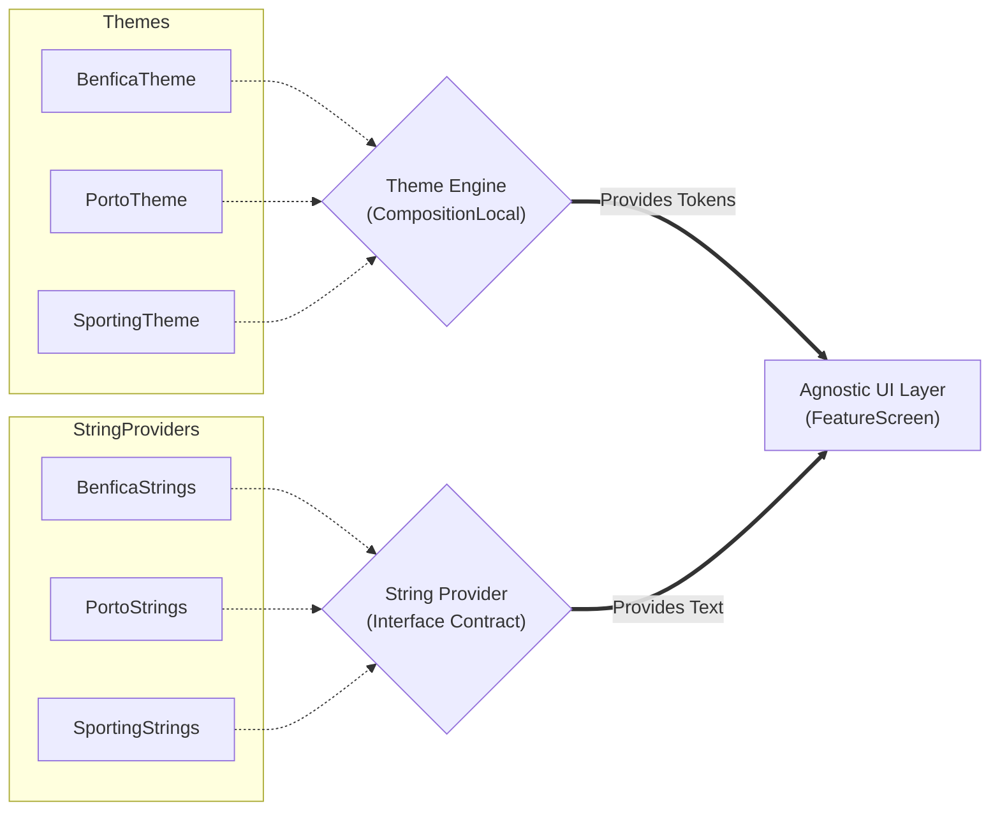

# PortugalTeams — Whitelabel Multi-Theming Architecture Lab

System Design laboratory for Whitelabel Apps in Jetpack Compose. This repository demonstrates a tenant-agnostic theme architecture using Portuguese football clubs as a domain example.

## The Architectural Problem

Scaling the user interface for multiple clients is a structural engineering problem, not just a styling issue.

- Coupling: UI becomes dependent on client-specific rules when color and layout decisions are fixed within the view layer.
- Conditional Logic: Using if/else or when blocks to check for the active client inside components creates hard-to-maintain code.
- Copywriting: The Compose code should not need to know whether the user is in the Benfica, Porto, or Sporting environment to decide which text to display.

## The Solution: Double Contract Injection

The architecture enforces a separation between feature UI and client branding through two main injection points:

- Theme Engine: Defines the design contract (colors and tokens) via PortugalTeamsTheme and injects it through CompositionLocal.
- String Engine: Abstracts text resources through FeatureStringsResourceProvider, removing direct dependence on R.string within the UI layer.

## Architecture Diagram



## Technical Implementation

### Contract Implementation (Example: Porto)

Tenant-specific details are isolated within their own contract implementations.

```kotlin
// Theme Contract Implementation
class PortoTheme : PortugalTeamsTheme {
    override val colors: CustomColors = CustomColors(
        background = Color.White,
        buttonColor = Color(0xFF004B87),
        buttonTextColor = Color.White
    )
}

// String Contract Implementation (in separate file)
class PortoStrings(val context: Context) : FeatureStringsResourceProvider {
    override fun getButtonTitle(): String = context.getString(R.string.button_title)
}
```

### Orchestration at UI Layer

The UI layer handles injection, decoupled from MainActivity. The string provider is instantiated in the composable scope, not as a class field in the Activity.

```kotlin
class MainActivity : ComponentActivity() {
    override fun onCreate(savedInstanceState: Bundle?) {
        super.onCreate(savedInstanceState)
        setContent {
            val stringsResourceProvider = PortoStrings(this@MainActivity)
            AppTheme(theme = PortoTheme()) {
                FeatureScreen(stringsResourceProvider = stringsResourceProvider)
            }
        }
    }
}
```

## Pattern Benefits

- Framework Independence: UI logic is agnostic and can be tested or ported without carrying specific tenant dependencies.
- Scalability: Adding a new client requires only implementing the theme and string contracts, without changes to the feature code.
- Technical Purism: Zero conditional branding logic within Composables.