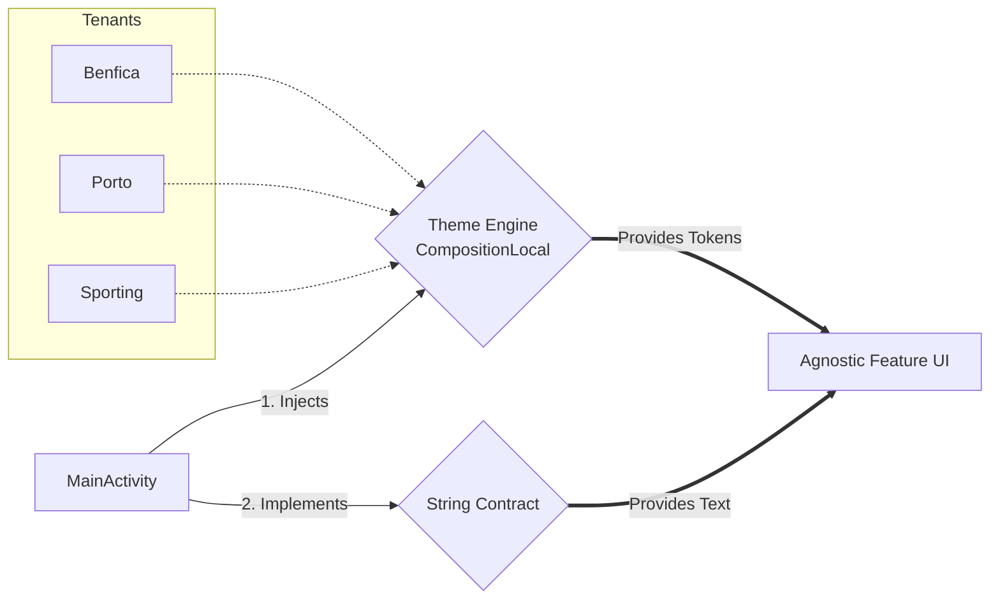

# PortugalTeams — Whitelabel Multi-Theming

A system design laboratory for Whitelabel Apps in Jetpack Compose. This repository demonstrates a composable, tenant-agnostic theming architecture using Portuguese football clubs as the domain example.

## The Architectural Problem

Scaling UI across multiple tenants is a structural problem, not just a styling problem.

- UI becomes tightly coupled to tenant-specific rules when color and layout decisions are embedded in the screen layer.
- The classic escalation is `if/else` branching across components, screens, and themes, which creates spaghetti logic.
- Tenant-specific copywriting and labeling compounds the problem: the Compose tree should not need to know whether a user is on Benfica, Porto, or Sporting.
- The result is low testability, poor reuse, and a maintenance burden that grows faster than the number of clients.

## The Solution

This repository enforces a strict separation between feature UI and tenant branding.

- `PortugalTeamsTheme` defines the theme contract.
- Tenant modules implement the contract in concrete theme classes like `BenficaTheme`, `PortoTheme`, and `SportingTheme`.
- `AppTheme` injects the active tenant's tokens using `CompositionLocalProvider`.
- Feature UI consumes styling via `LocalThemeColors`.
- String resources are abstracted with `FeatureStringsResourceProvider`, so Compose only depends on a string contract and not on tenant identity.

This eliminates theme coupling and tenant-specific copy logic from the Compose layer.

### Architecture Diagram



## Code Snippets

### Root-level Theme and String Provider Injection

```kotlin
setContent {
    AppTheme(theme = BenficaTheme()) {
        FeatureScreen(stringsResourceProvider = this)
    }
}
```

### Theme Provider Implementation (CompositionLocal)

```kotlin
@Composable
fun AppTheme(theme: PortugalTeamsTheme, content: @Composable () -> Unit) {
    MaterialTheme

    CompositionLocalProvider(
        LocalThemeColors provides theme.colors,
        content = content
    )
}
```

### Agnostic Composable Consumption

```kotlin
@Composable
fun FeatureScreen(modifier: Modifier = Modifier, stringsResourceProvider: FeatureStringsResourceProvider) {
    val backgroundColor = LocalThemeColors.current.background

    Box(
        modifier = Modifier
            .fillMaxSize()
            .padding(16.dp)
            .background(color = backgroundColor),
        contentAlignment = Alignment.Center,
    ) {
        PortugalTeamsButton(onClick = { }, text = stringsResourceProvider.getButtonTitle())
    }
}
```

## Why This Matters

This repository is intentionally strict about architectural boundaries. By treating theming as a token injection layer and string resources as an external contract, the Compose layer remains pure and reusable, while tenant-specific variance is confined to the theme provider and Activity boundary.
